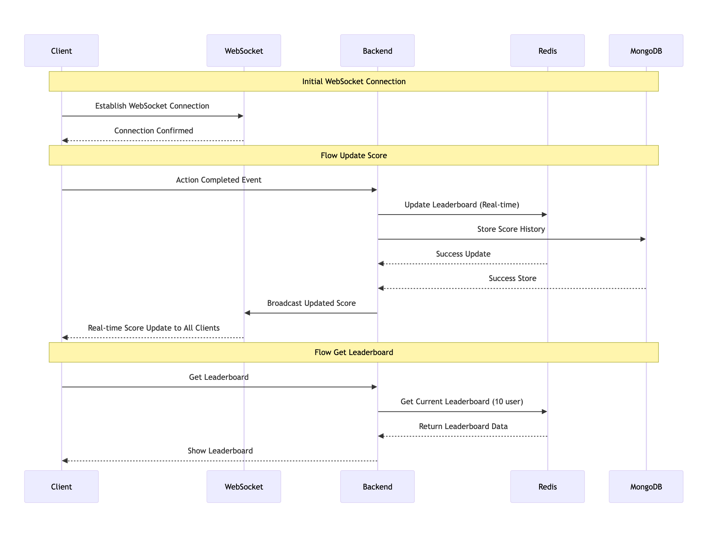

# Real Time Scoreboard API Service

## Overview
API service that handles real time score updates for a top 10 leaderboard system with security measures against unauthorized score manipulation.

## Sequence Diagram

## Features
- Real time scoreboard updates
- Top 10 users score tracking
- Secure score submission
- WebSocket integration for live updates
- Rate limiting and security measures

## Technical Architecture
- Backend: Node.js with Express.js
- Database: Redis (for real time data) + MongoDB (for persistence)
- WebSocket: Socket.io
- Authentication: JWT

## API Endpoints
- GET /api/scoreboard - Retrieve top 10 scores
- POST /api/score/update - Update user score
- WS /scoreboard - WebSocket connection for real-time updates